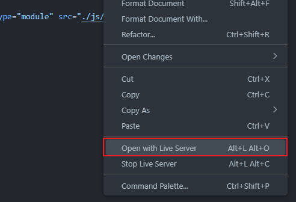

# Canvas-study

HTML5 Canvas Tutorial Study Note

Some of the notes follow a few vedioes from [this youtube playlist.](https://youtube.com/playlist?list=PLGf_tBShGSDNGHhFBT4pKFRMpiBrZJXCm)   
Thank you for [@cmiscm](https://www.youtube.com/@cmiscm)

And each README file has an inspired code URL.

## Run

Please open `index.html` with js module using like live server in VS Code extensions.

